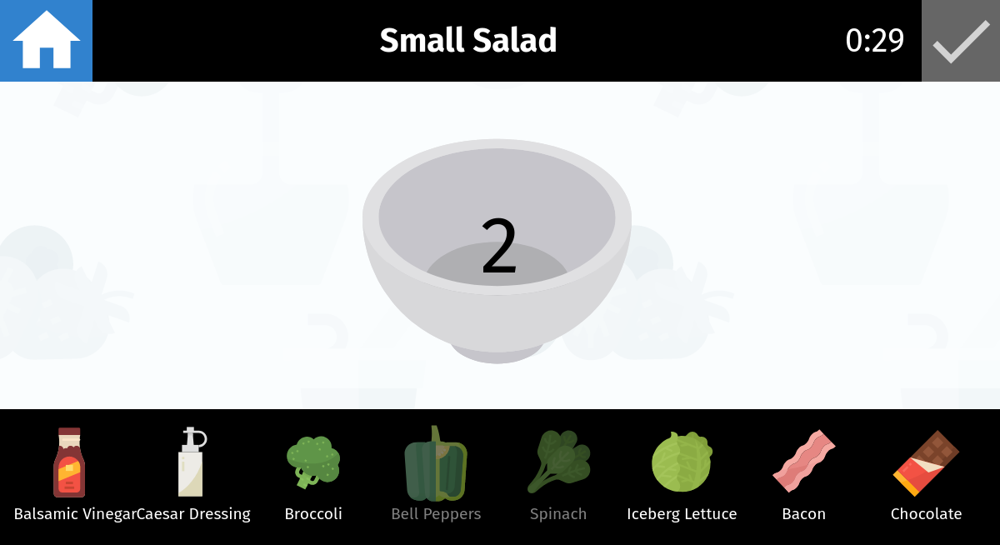

# 🥗 Healthy Chef 

This project is the prototype of a _serious game_ for the Adaptive Serious Game class of the University of Paris-Saclay.
It was designed to teach children about healthy recipes and food choices.

This prototype was co-developed with Bryan H. (healthy game designer) and Lilly A. H. (asset creator and curator).

**[🎮 Play the last version online](https://daru13.github.io/psud-serious-cooking-game/html)**

**Note for mobile players:** the game should work fine, except for the horizontal scrolling of the list of ingredient!

## Technical details

### Project organisation

The project is written in **TypeScript** and the user interface is fully designed using modern HTML and CSS.
Its single runtime dependency is [`interact.js`](https://interactjs.io/), which is used for a smooth drag and drop experience (given how [_stunning_](https://www.quirksmode.org/blog/archives/2009/09/the_html5_drag.html) is HTML5's API ;)).

[Rollup](https://rollupjs.org/guide/en/) is used to bundle the transpiled TypeScript files into a single JS file.

### Build instructions

We use [`yarn`](http://yarnpkg.com) to manage the development dependencies and to run scripts, but it should work fine if you prefer to use another package manager such as `npm`.

To create your own build, clone this repository and run the following commands:
- `yarn` (to install the development dependencies).
- `yarn build` (to compile and bundle TypeScript sources into the `build` folder).
;
You can also run `yarn watch` to start Rollup in watch mode (_i.e._ automatically recompile the sources when a TypeScript file is modified).